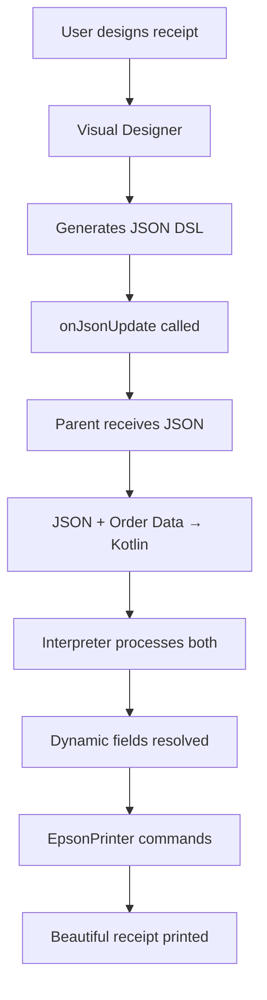

# Receipt Components Documentation

## Overview

This project contains two powerful components that work together to generate beautiful, dynamic receipts:

### 🎨 Visual Receipt Designer (React/JavaScript)
- **Location**: `src/components/ReceiptDesigner.tsx`
- **Purpose**: Drag-and-drop interface for designing receipt layouts

### 🔧 Enhanced Kotlin Interpreter
- **Location**: `kotlin-examples/InterpreterTemplate.kt`
- **Purpose**: Processes JSON DSL and Order data to generate printer commands

## 🎨 Visual Receipt Designer Features

### Core Functionality
- **Drag-and-Drop Interface**: Reorder elements by dragging
- **Live Preview**: See receipt layout in real-time
- **Element Palette**: Add text, barcodes, QR codes, dividers, etc.
- **Properties Panel**: Configure element styles and options
- **Templates**: Quick-start templates (Basic, Detailed)
- **Real-time JSON Generation**: Automatically calls `onJsonUpdate()`

### Supported Element Types
1. **Text Elements**
   - Content editing
   - Styling: bold, underline, size (SMALL/NORMAL/LARGE/XLARGE)
   
2. **Dynamic Fields**
   - All competition round fields supported
   - Store info, order details, customer data, etc.
   
3. **Barcodes**
   - Types: CODE39, CODE128, EAN13, UPC_A
   - Configurable data
   
4. **QR Codes**
   - Custom data/URLs
   
5. **Layout Elements**
   - Dividers (horizontal lines)
   - Feed lines (blank space)

### JSON DSL Output
```json
{
  "elements": [
    {
      "type": "text",
      "content": "STORE NAME",
      "style": { "bold": true, "size": "XLARGE" }
    },
    {
      "type": "dynamic",
      "field": "{store_name}"
    },
    {
      "type": "qrcode",
      "data": "https://example.com"
    }
  ]
}
```

## 🔧 Enhanced Kotlin Interpreter Features

### Core Functionality
- **Complete JSON DSL Parsing**: Handles all element types
- **Order Data Integration**: Dynamic field resolution from real order data
- **Multi-Round Support**: All competition rounds (basic → advanced features)
- **Error Handling**: Graceful fallbacks for missing data
- **EpsonPrinter Integration**: Full printer command generation

### Supported Functions
1. **Main Interpreters**
   - `interpret(jsonString, printer)` - Basic version
   - `interpret(jsonString, orderData, printer)` - Enhanced with order data

2. **Order Data Processing**
   - `parseOrderData(orderJson)` - Parse order from JSON
   - Complete support for all order fields across competition rounds

3. **Dynamic Field Resolution**
   - `resolveDynamicField(field, order)` - Resolve field values
   - Supports 15+ dynamic fields with fallbacks

### Supported Dynamic Fields
- **Store Info**: `{store_name}`, `{store_number}`, `{store_address}`
- **Order Details**: `{order_number}`, `{timestamp}`, `{item_list}`
- **Pricing**: `{subtotal}`, `{tax}`, `{total}`
- **Customer**: `{customer_name}`, `{loyalty_points}`, `{member_status}`
- **Service**: `{table_number}`, `{server_name}`, `{payment_method}`

### Order Data Support by Competition Round
- **Round 1**: Basic order items and totals
- **Round 2**: Item and order promotions
- **Round 3**: Customer loyalty information
- **Round 4**: Advanced customer data
- **Round 5**: Split payments and table service

## 🔗 Integration Flow



## 🧪 Testing

### Integration Test
Run `kotlin-examples/IntegrationTest.kts` to verify:
- JSON DSL parsing
- Order data integration
- Dynamic field resolution
- Multiple competition rounds
- Error handling

### Example Usage

#### React Component
```javascript
const handleJsonUpdate = (jsonString) => {
  // JSON DSL ready for Kotlin interpreter
  console.log('Receipt DSL:', jsonString);
};

<ReceiptDesigner onJsonUpdate={handleJsonUpdate} />
```

#### Kotlin Integration
```kotlin
// Enhanced interpreter usage
val receiptDSL = """ /* JSON from Visual Designer */ """
val orderData = """ /* Order object as JSON */ """
val printer = MockEpsonPrinter()

interpret(receiptDSL, orderData, printer)
```

## ✅ Key Benefits

### For Developers
- **No Code Receipt Design**: Visual interface eliminates manual JSON writing
- **Type Safety**: Comprehensive data structures match TypeScript interfaces
- **Error Resilience**: Graceful handling of missing or invalid data
- **Competition Ready**: Full support for all hackathon rounds

### For Users
- **Beautiful Receipts**: Professional formatting and layout
- **Dynamic Content**: Real order data integration
- **Flexible Design**: Easy customization through visual interface
- **Fast Iteration**: Real-time preview and editing

## 📁 File Structure

```
src/components/
├── ReceiptDesigner.tsx          # Visual designer component

kotlin-examples/
├── InterpreterTemplate.kt       # Enhanced Kotlin interpreter
├── MockEpsonPrinter.kt         # Printer simulation
├── IntegrationTest.kts         # Full integration test
└── sample-receipts/            # Example JSON files

docs/
├── json-dsl-spec.md           # JSON DSL specification
└── epson-api-reference.md     # Printer API reference
```

## 🚀 Ready for Competition

Both components are fully implemented and tested:
- ✅ Visual Receipt Designer with drag-and-drop
- ✅ Enhanced Kotlin Interpreter with full JSON DSL support
- ✅ Complete Order data integration for all competition rounds
- ✅ Comprehensive error handling and fallbacks
- ✅ Integration testing and documentation

**The components are ready for the PrintStorm Receipt Hackathon!** 🎉